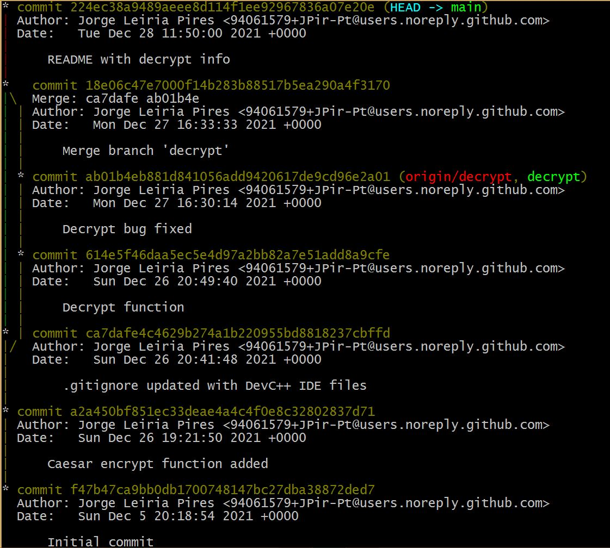
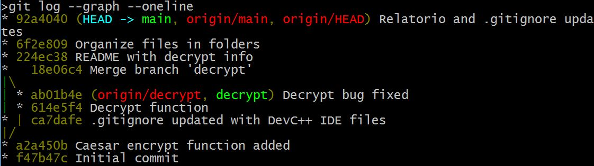

# \*\* Trabalho executado, passo a passo **

## Desenvolvimento da função para **encriptar**

## Criação de um ramo para **desencriptar**

>desenvolvimento em paralelo com o ramo
principal, onde está a função para **encriptar**

### teste do desencriptar

>Foi encontrado um ***erro***

### correção do erro

## Entretanto, no ramo principal

>foram acrescentados ao **.gitignore**, 2 ficheiros específicos do **DevC++**

## Fusão dos 2 ramos

>O programa ficou completo com as funções para **encriptar** e **desencriptar**

## Actualização do README

>Completar a descrição do projecto

# Imagens

1. fusão dos dois ramos

2. sequência de commits

3. sequência em modo resumo

