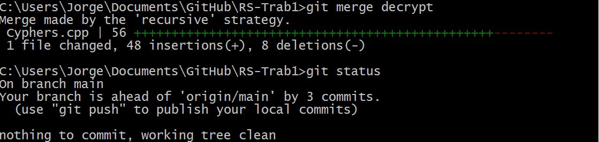

# ** Trabalho executado passo a passo **
## Desenvolvimento da função para **encriptar**
## Criação de um ramo para **desencriptar**
>desenvolvimento em paralelo com o ramo
principal onde está a função para **encriptar**
### teste do desencriptar
>Foi encontrado um ***erro***
### correção do erro
## Entretanto, no ramo principal
>foram acrescentados 2 ficheiros específicos do DevC++, ao .gitignore
## Fusão dos 2 ramos
>O programa ficou completo com as funções para **encriptar** e **desencriptar**
## Actualização do README
>Completar a descrição do projecto

# Imagens
1. fusão dos dois ramos

2. sequência de commits

